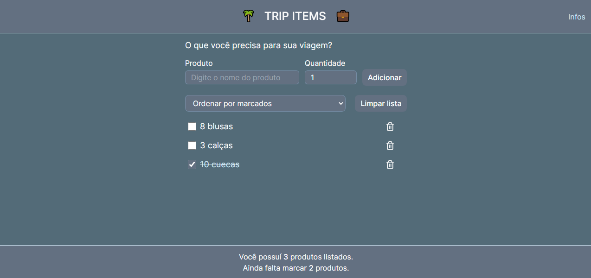
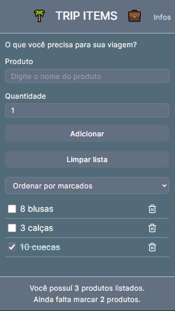
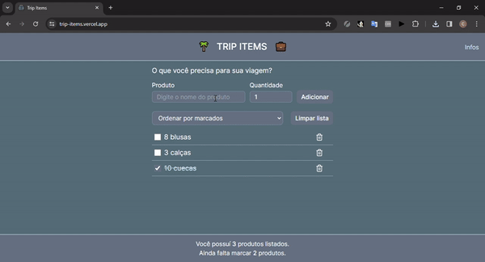

## 🖥 Desktop

## 📱 Mobile

## 📌 Sobre

**Trip-items** é um projeto para anotação de itens para viagem.

## 🚀 Tecnologias utilizadas

O projeto foi desenvolvido utilizando as seguintes tecnologias:

- [Next](https://nextjs.org/)
- [Typescript](https://www.typescriptlang.org/)
- [Tailwindcss](https://tailwindcss.com/)
- [React Hook Form](https://www.react-hook-form.com/)
- [Zod](https://zod.dev/)

## 💻 O projeto pode ser vizualizado acessando o seguinte link

<https://trip-items.vercel.app/>

## 👀  Exemplo

